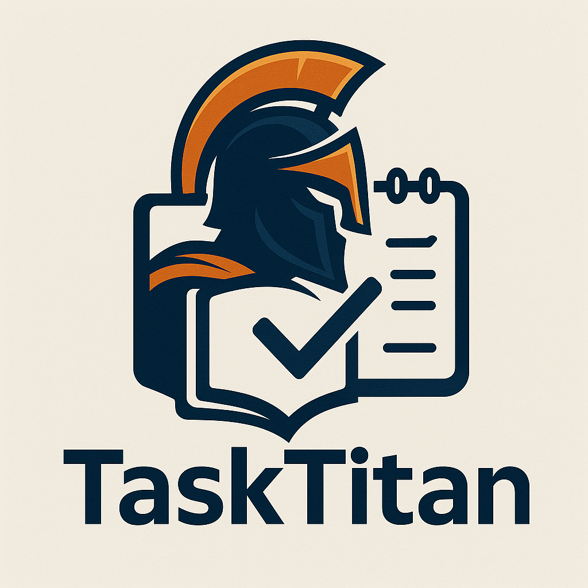

<div align="center">
  
  <br>
  <h1>TaskTitan</h1>
  <p>
    <strong>Stop Juggling Apps. Start Achieving Goals.</strong>
  </p>
  <p>
    TaskTitan is your all-in-one desktop command center for productivity. <br />
    Unify your tasks, goals, habits, and focused work sessions in one beautiful, powerful application.
  </p>
  <p>
    <a href="https://github.com/mahan2079/TaskTitan/actions/workflows/tests.yml"></a>
    <a href="https://github.com/mahan2079/TaskTitan/actions/workflows/release.yml"></a>
    <a href="https://www.python.org/"></a>
    <a href="LICENSE"></a>
  </p>
</div>

---

## ✨ Why TaskTitan?

Tired of switching between a to-do list, a habit tracker, a calendar, and a Pomodoro timer? TaskTitan integrates these tools into a single, seamless workflow designed to minimize distractions and maximize your output.

-   🧠 **Become an Architect of Your Life**: Go beyond simple to-do lists. With hierarchical goal management, you can break down your biggest ambitions into manageable steps and watch your progress come to life.

-   📊 **Visualize Your Success**: Don't just work—see the results. With integrated charts and analytics for productivity, mood, and time tracking, you get a clear view of your accomplishments and areas for improvement.

-   🔁 **Build Lasting Habits**: Our dedicated habit tracker helps you build positive routines and break bad ones. Track your streaks and stay motivated with a system designed for consistency.

-   🍅 **Master Deep Work**: The built-in Pomodoro timer, complete with distraction tracking, helps you get into a state of flow and maintain focus on what truly matters.

## 🖼️ Gallery

*(A sneak peek of the TaskTitan interface. Add your screenshots here!)*

| Dashboard View | Daily Planner | Productivity Tracker |
| :---: | :---: | :---: |
| `[Screenshot of Dashboard]` | `[Screenshot of Daily Planner]` | `[Screenshot of Productivity Tracker]` |

---

## 🚀 Features at a Glance

| Feature | Description |
| :--- | :--- |
| 🎯 **Goal Management** | Hierarchical goals, deadlines, priorities, and progress tracking. |
| ✅ **Unified Activities** | Manage tasks, events, and habits in one place. |
| 🗓️ **Daily & Weekly Planner** | Plan your time with an integrated calendar and time-blocking. |
| 💪 **Habit Tracking** | Create, track, and analyze your habits and streaks. |
| 🍅 **Pomodoro Timer** | Customizable focus and break intervals with session history. |
| 📈 **Productivity Analytics** | Track time, mood, and energy with visual reports. |
| 🎨 **Themes** | Switch between beautiful dark and light modes. |
| 🔍 **Powerful Search** | Instantly find any task, goal, or note across the app. |
| 💾 **Auto-Backup** | Keep your data safe with automatic, scheduled backups. |


## 🛠️ Tech Stack

TaskTitan is built with a modern and robust set of technologies, making it both powerful and extensible.

-   **Backend**: Python 3.8+
-   **GUI**: PyQt6
-   **Database**: SQLite
-   **Charting**: Matplotlib & pyqtgraph
-   **Code Quality**: `black`, `flake8`, `isort`, `mypy`

---

## ⚡ Quick Start

Get up and running in less than a minute.

1.  **Clone the repo:**
    ```bash
    git clone https://github.com/mahan2079/TaskTitan.git && cd TaskTitan
    ```

2.  **Set up your environment:**
    ```bash
    python -m venv venv
    source venv/bin/activate  # On Windows: venv\Scripts\activate
    ```

3.  **Install dependencies:**
    ```bash
    pip install -r TaskTitan/requirements.txt
    ```

4.  **Launch!**
    ```bash
    python TaskTitan/run.py
    ```

## 🏗️ Build Your Own Executable

Want to build a standalone version of TaskTitan? We use PyInstaller.

```bash
pip install pyinstaller
pyinstaller TaskTitan/tasktitan.spec
```
Find your shiny new executable in the `TaskTitan/dist` folder. For more details, see the [BUILD.md](TaskTitan/BUILD.md) guide.

---

## 🤝 Join the Development

TaskTitan is built by and for its users. We welcome contributions of all kinds, from bug fixes to new features.

-   **Found a bug?** [Open an issue](https://github.com/mahan2079/TaskTitan/issues).
-   **Have an idea?** [Start a discussion](https://github.com/mahan2079/TaskTitan/discussions).
-   **Ready to contribute?** Check out our [Developer Guide](TaskTitan/docs/DEVELOPMENT.md) to get started.

Let's build the ultimate productivity tool together!

## License

Distributed under the Apache 2.0 License. See `LICENSE` for more information.

## Contact

Mahan Dashti Gohari - mahan.dashiti.gohari@gmail.com

Project Link: [https://github.com/mahan2079/TaskTitan](https://github.com/mahan2079/TaskTitan)
